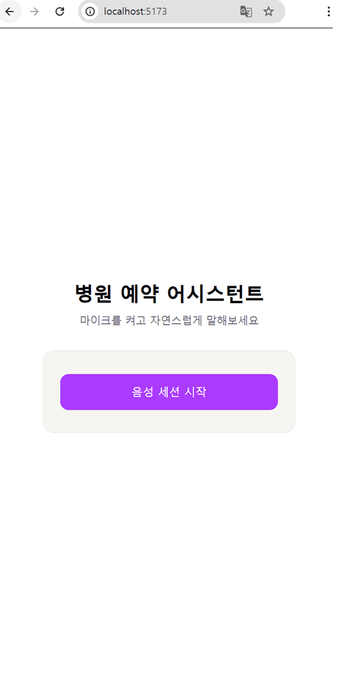
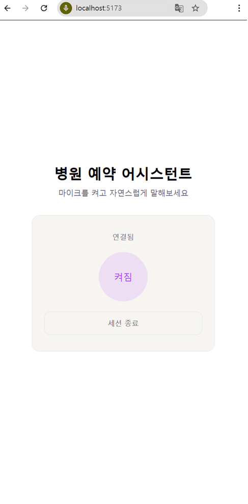
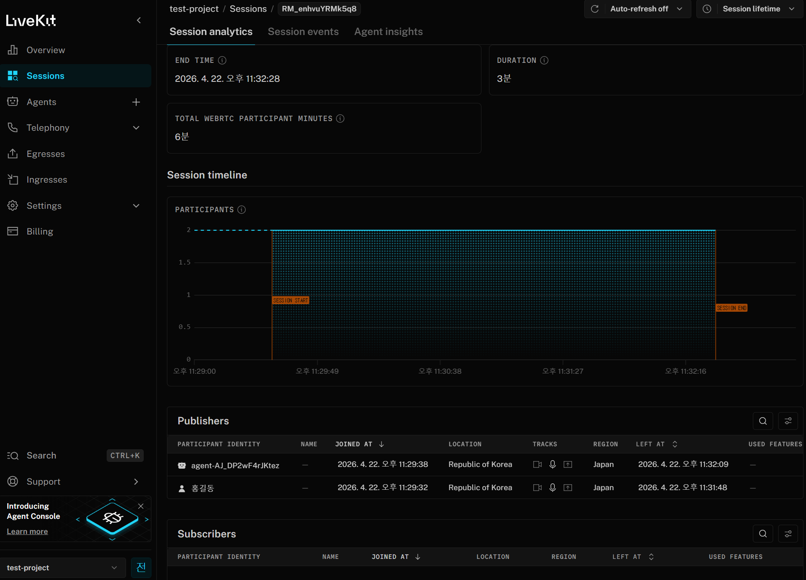
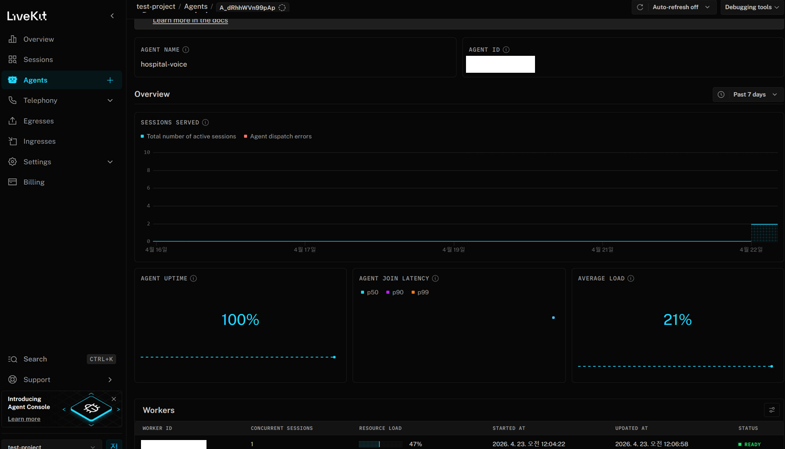

## AI Agent Test

### Agent Service Branches
- feature/healthcare-voice-agent

#### 사용 방법

마이크 권한을 허용한 뒤 화면의 **"음성 세션 시작"** 버튼을 누르고 자연스럽게 말씀하세요. 
음성 어시스턴트가 대화 흐름에 따라 필요한 정보를 조회하거나 예약을 처리합니다.

대화 예시:
- "두통이 심한데 어느 진료과 가야 할까?"
- "강남 근처 내과 병원 추천해줘"
- "내 예약 목록 보여줘"
- "내일 오후 2시 예약 취소해줘"

  
  
  
  

